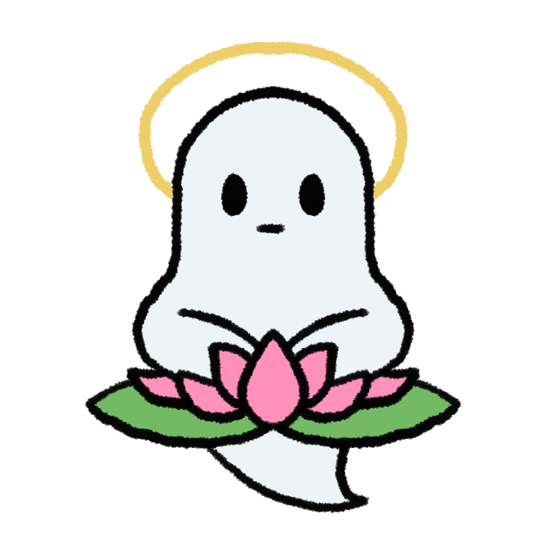
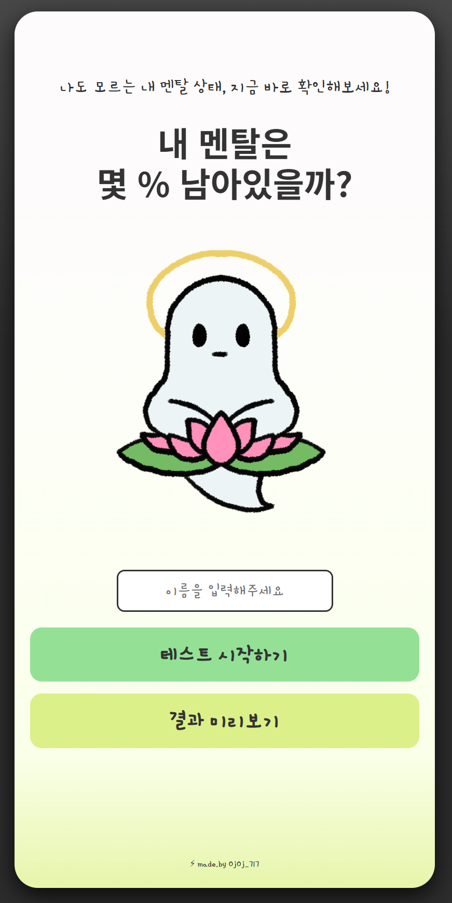
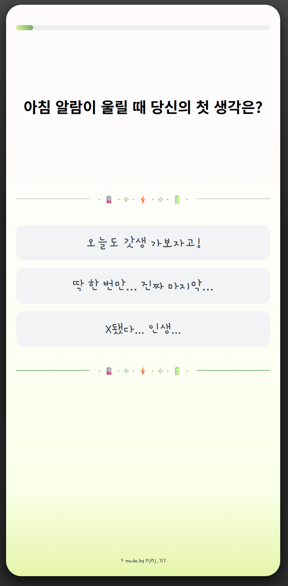
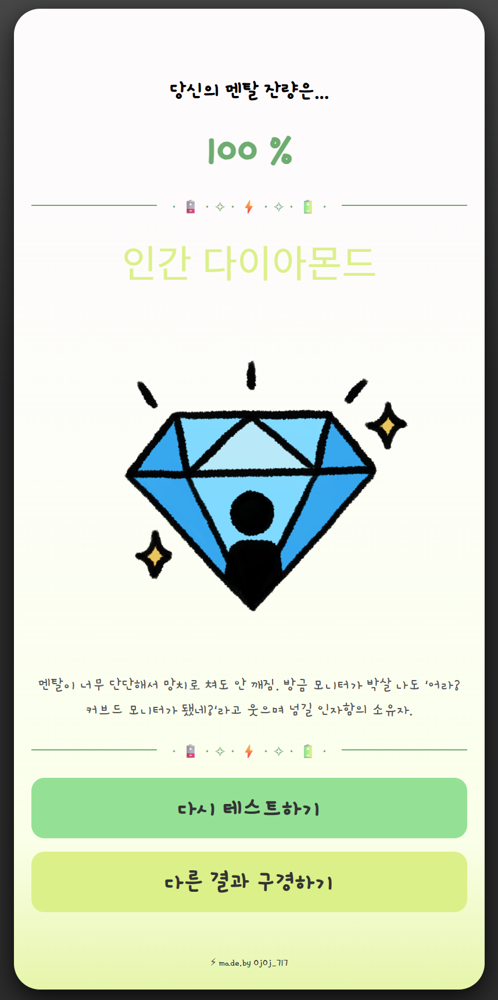
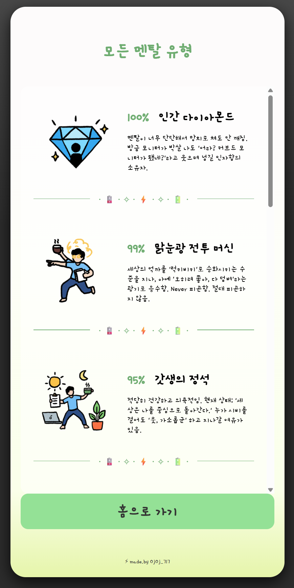

# 🧠 내 멘탈은 몇 % 남아있을까?

    

  

  <h3>"내 멘탈은 몇 % 남아있을까?"</h3>
  
나도 모르는 내 멘탈 상태, 지금 바로 확인해보세요!

  

    

 

## 💡 ABOUT PROJECT

**현대인의 고질병, '번아웃(Burnout)'!**  
우리는 앞만 보고 달리느라 정작 자신의 마음이 얼마나 타들어 가고 있는지 놓치곤 합니다.  
이 프로젝트는 재밌는 심리테스트 문항으로, 방전 직전의 당신을 위한 **멘탈 충전 가이드**가 되어드립니다.

 

### ✨ Key Features

* **📱 Multi-Device Support**: 모바일과 데스크톱 어디서든 쾌적하게 즐길 수 있는 **반응형 웹 디자인**
* **🧩 User Friendly UI**: 누구나 쉽게 참여할 수 있는 **깔끔하고 직관적인 인터페이스**
* **🎨 Hand-Drawn Artwork**: 제작자가 **직접 그린** 결과 이미지

 

## 🗓️ PROJECT PERIOD
> **2026.01.29 ~ 2026.01.31**

 

## 🛠️ TECH STACK

  
  
  
  

 

## 🖥️ PREVIEW

  <table border="1" style="border-collapse: collapse; border-color: #d0d7de;">
    <tr>
      <td style="background-color: #faffe9; padding: 20px;">
         
        <table>
          <tr align="center">
            <td><b>🏠 메인 화면</b></td>
            <td><b>📝 질문 페이지</b></td>
            <td><b>📊 결과 리포트</b></td>
            <td><b>🔍 모든 결과 확인</b></td>
          </tr>
          <tr align="center">
            <td></td>
            <td></td>
            <td></td>
            <td></td>
          </tr>
          <tr align="center">
            <td><small><i>멘탈 체크의 시작</i></small></td>
            <td><small><i>당신의 속마음은?</i></small></td>
            <td><small><i>남은 멘탈 % 확인</i></small></td>
            <td><small><i>전체 결과 모아보기</i></small></td>
          </tr>
        </table>
      </td>
    </tr>
  </table>

## 📂 DIRECTORY STRUCTURE

<pre>
<b>Mental-Percentage-Test</b>
├── 📄 <b>index.html</b>           # 메인 진입 페이지
├── 📂 <b>css/</b>
│   └── 🎨 style.css        # 전체 UI/UX 디자인
├── 📂 <b>js/</b>
│   ├── 📊 data.js          # 질문, 선지 및 결과 데이터
│   └── 🧠 main.js          # 멘탈 계산 알고리즘
└── 📂 <b>img/</b>                 # 비주얼 리소스 모음
</pre>

 

## 👤 AUTHOR

   
  
   
  
  ### **Ojing-Ojing (군오징)**
  "코딩하는 오징어, 군오징입니다! 🦑"
  
  

 

## 🎬 CREDITS
이 프로젝트는 아래의 오픈소스 및 리소스의 도움을 받아 제작되었습니다.
* **[Gemini](https://gemini.google.com/)**: 질문 및 선지, 결과 컨셉 아이디어
* **[Noonnu (눈누)](https://noonnu.cc/)**: '카페24 서라운드' 웹 폰트 적용
* **[Google Fonts](https://fonts.google.com/)**: '감자꽃' 웹 폰트 적용
* **[Shields.io](https://shields.io/)**: 리드미 작성

 

---

  
This project is licensed under the <b>MIT License</b>.

  
© 2026 <b>ojoj717</b>. Some rights reserved.

